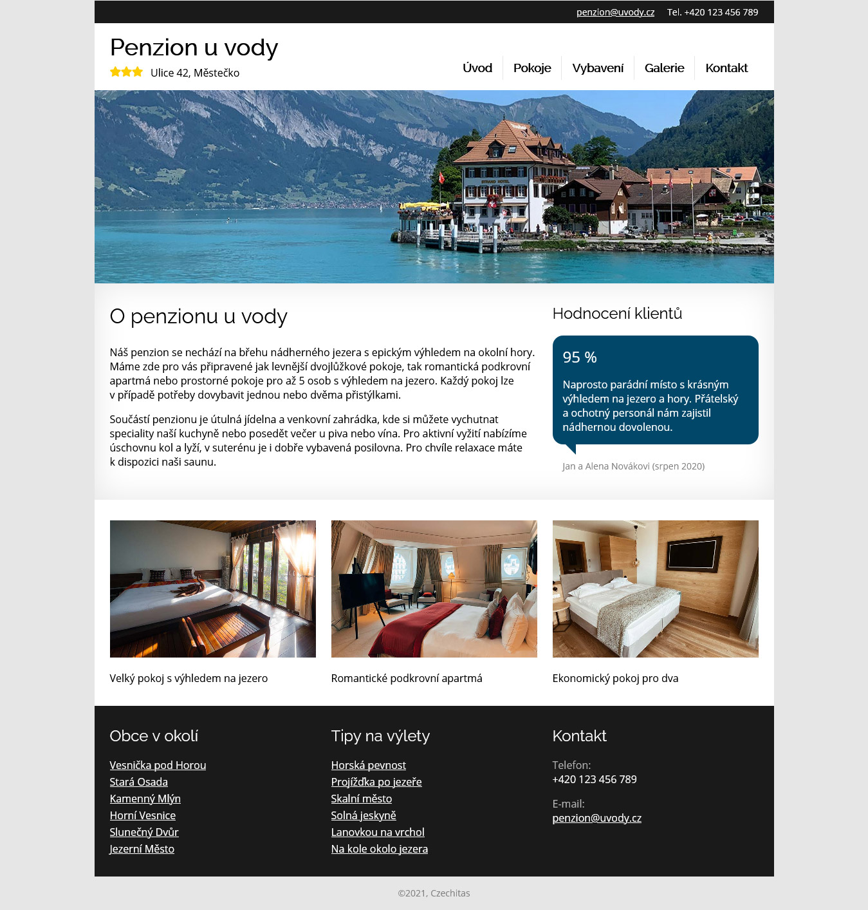

# Penzion u vody

Povinný projekt, odevzdání je nutné pro závěrečnou klasifikaci.

- [Cíl úkolu](#Cíl-úkolu)
- [Úkoly](#Úkoly)

Než začneš s projektem cokoliv dělat, přečti si prosím celý tento text až do konce.

Tentokrát jako podklad dostáváš kompletně nakódovaný web o pěti stránkách. Tvým úkolem je udělat z něho Eleventy projekt, z částí stránky společných pro celý web udělat šablonu, ve stránkách samotných nechat pouze obsah a vše nastavit tak, aby výsledkem byl opět hotový a funkční web.

## Cíl úkolu

Cílem tohoto úkolu je hlavně vyzkoušet si základní práci s generátorem statických webů Eleventy:
- **Práce s Eleventy**
  - součástí zadání je kompletně nakódovaný pětistránkový web (HTML, CSS, obrázky)
  - proveď v projektu `npm init` a nainstaluj Eleventy
  - nakonfiguruj Eleventy podle instrukcí v lekci **Eleventy - konfigurace** (hlavně aby se do sestaveného webu kopírovaly složky `css` a `images`)
  - v sekci `scripts` souboru *package.json* vytvoř dva skripty `build` a `serve`
  - spusť web lokálně pomocí skriptu `serve` a vyzkoušej, zda vše funguje správně **//
- **Vytvoření šablony**
  - všech pět stránek webu má společnou hlavičku a patičku
  - vytvoř ze společných částí šablonu podle instrukcí v lekci **Eleventy - První šablona**
  - v HTML stránkách nech pouze obsah unikátní pro danou stránku
  - do stránek přidej **front matter** a nastav stránky tak, aby používaly vytvořenou šablonu
  - v HTML (v šabloně i v obsahu) a v CSS uprav cesty k obrázkům, stylům, apod. tak, aby začínaly lomítkem a ukazovaly na správné soubory
  - v šabloně uprav menu, aby ukazovalo na správné adresy stránek, až Eleventy vygeneruje výsledný web
- **Práce s Gitem**
  - ověř, že v souboru *.gitignore* ignorujeme složku *_site* a *node_modules*, protože ani jednu z nich v Gitu nechceme ukládat
  - proveď commit a push řešení na GitHub
  - odkaz na repozitář odevzdej v úkolu vytvořeném v Teams, repozitář musí být veřejný kvůli kontrole

## Úkoly

Povinná část úkolu:

- **Responzivní webdesign**
  - v CSS je nakódovaná pouze počítačová verze webu
  - vymysli, jak by mohla vypadat mobilní a tabletová verze a doplň je do CSS
  - nezapomeň, že používáme přístup **mobile first**, takže je pravděpodobné, že části již hotového CSS budeš muset trochu přeskládat
- **Kódování CSS**
  - CSS předělej tak, aby byl využíván Sass preprocesor
- **BEM**
  - v projektu přejmenuj třídy tak, aby odpovídaly metodice BEM pro pojmenování tříd a tyto třídy využij při psaní CSS stylů pomocí Sass

